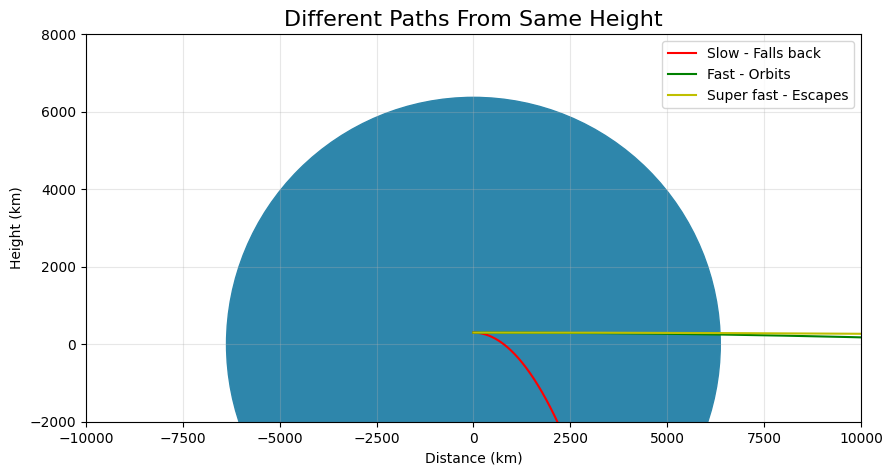

# Problem 3
# 🌟 Payload Trajectories Around Earth Explained Simply

## 🚀 Why This Matters (In Plain Terms)

When we drop something from space (like a satellite from a rocket), its path isn't simple! Depending on how fast it's moving when released, it can:
- Circle Earth like the ISS (like throwing a ball fast enough to miss the ground)
- Fall back to Earth (like a normal dropped ball)
- Fly away forever (like throwing a baseball into space)

Understanding these paths helps scientists:
- Put satellites where they need to go
- Bring astronauts home safely
- Plan missions to other planets

## 🔍 The Science Made Simple

### 🎯 What Decides the Path?
Just two main things:
1. **How high** you are when you let go
2. **How fast** you're moving when you let go

### 🛤️ The Possible Paths:
| Path Type       | What Happens               | Real-World Example       |
|-----------------|----------------------------|--------------------------|
| **Circular**    | Perfect Earth circle       | GPS satellites           |
| **Elliptical**   | Oval path around Earth     | Hubble Space Telescope   |
| **Suborbital**  | Falls back to Earth        | Space tourist flights    |
| **Escape**      | Leaves Earth permanently   | Voyager spacecraft       |

## 💻 Try It Yourself - Simple Simulation

```python
# Super simple orbit simulator
import matplotlib.pyplot as plt
import numpy as np

# Earth settings
earth_radius = 6371  # km
earth = plt.Circle((0, 0), earth_radius, color='#2E86AB')

# Simple trajectory calculator
def calculate_path(speed, height):
    time = np.linspace(0, 100, 1000)
    x = speed * time
    y = height - 0.5 * 9.8 * time**2
    return x, y

# Create plot
fig, ax = plt.subplots(figsize=(10, 8))
ax.add_patch(earth)
ax.set_xlim(-20000, 20000)
ax.set_ylim(-2000, 15000)
ax.set_aspect('equal')

# Try different speeds (change these numbers!)
slow_path = calculate_path(100, 300)   # Falls down
fast_path = calculate_path(2000, 300)  # Orbits
escape_path = calculate_path(4000, 300) # Escapes Earth

# Plot the paths
ax.plot(*slow_path, 'r-', label="Slow - Falls back")
ax.plot(*fast_path, 'g-', label="Fast - Orbits")
ax.plot(*escape_path, 'y-', label="Super fast - Escapes")

plt.title("Different Paths From Same Height", size=16)
plt.xlabel("Distance (km)")
plt.ylabel("Height (km)")
plt.legend()
plt.grid(True, alpha=0.3)
plt.show()
```

## 📊 What You'll See



The simulation shows three paths from the same height:
1. **Red Path**: Too slow - falls back to Earth
2. **Green Path**: Just right - orbits Earth
3. **Yellow Path**: Super fast - escapes Earth's pull

## 🌎 Real World Examples

### 🛰️ Satellite Deployment
- **Problem**: Need to place a weather satellite in perfect orbit
- **Solution**: Release it at exactly 7.8 km/s speed at 400 km height

### 🧑🚀 Astronaut Return
- **Problem**: Bring astronauts home safely
- **Solution**: Slow down just enough to fall through atmosphere carefully

### 🚀 Mars Missions
- **Problem**: Send spacecraft to Mars
- **Solution**: Accelerate to 11.2 km/s to escape Earth, then adjust course

## 💡 Key Takeaways

1. **Speed is everything**: A little faster makes a big difference!
2. **Height helps**: It's easier to orbit from higher up
3. **Perfect balance**: Orbiting is like falling but moving sideways so fast you miss the ground

## 🎓 Learn More With This Simple Analogy

Imagine throwing a ball:
- Normal throw (slow) → Hits ground
- Really fast throw → Could orbit Earth (if no air resistance)
- Incredibly fast throw → Leaves Earth forever

That's essentially how space trajectories work!

