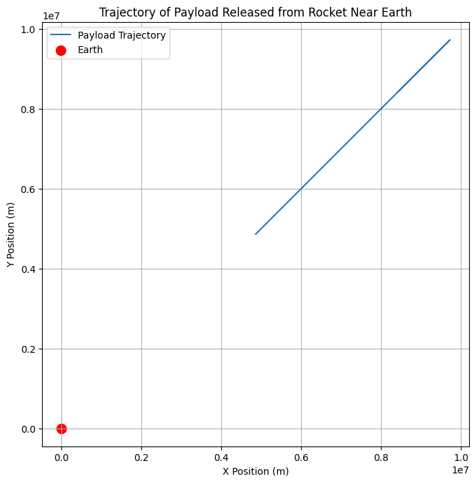

# Problem 3
## 🚀 **Problem 3: Trajectories of a Freely Released Payload Near Earth**

### **Motivation:**
When a payload is released from a moving spacecraft or rocket near Earth, its trajectory is influenced by the gravitational forces exerted by the Earth. The path that the payload takes depends on its **initial velocity**, **position**, and **altitude**. This problem gives insight into understanding real-world scenarios like payload deployment, orbital insertion, or reentry.

### **Task Breakdown:**
1. **Analyze Possible Trajectories:**
    - We need to consider the different trajectories a payload can take once released. These could be:
      - **Parabolic:** The object moves in a curve and eventually falls back to Earth.
      - **Hyperbolic:** The object escapes Earth's gravity.
      - **Elliptical:** The object remains in orbit around Earth.

2. **Numerical Simulation:**
    - We’ll perform a **numerical analysis** to compute the path of the payload, given the initial conditions such as **position**, **velocity**, and **altitude**.

3. **Visualize and Interpret the Motion:**
    - We'll visualize the trajectory of the payload under Earth's gravity, considering different initial velocities and directions.
    - Discuss real-world applications such as **orbital insertion**, **reentry**, and **escape scenarios**.

---

## 1. **Theoretical Foundation**

### **Newton's Law of Gravitation**
Newton's law of universal gravitation states that the force between two objects is proportional to the product of their masses and inversely proportional to the square of the distance between them:

\[
F = \frac{GMm}{r^2}
\]

Where:  
- \( F \) is the gravitational force between Earth and the payload  
- \( G \) is the gravitational constant  
- \( M \) is the mass of Earth  
- \( m \) is the mass of the payload  
- \( r \) is the distance between the payload and the center of Earth

This force leads to the acceleration of the payload towards Earth.

### **Equations of Motion**
Using Newton's second law, the equations of motion for the payload are:

\[
\frac{d^2 r}{dt^2} = -\frac{GM}{r^2}
\]

Where:  
- \( r \) is the radial distance from the center of Earth
- \( \frac{d^2 r}{dt^2} \) is the acceleration of the payload
- \( G \) is the gravitational constant
- \( M \) is the mass of Earth

We’ll solve this equation numerically for different initial velocities and directions.

---

## 2. **Simulating the Trajectories**

### **Numerical Integration (Runge-Kutta Method)**
To simulate the motion, we use a **numerical method** like **Runge-Kutta** for solving the differential equation. This will allow us to calculate the payload's position and velocity at each time step.

### **Python Implementation**

We will use Python with libraries like **NumPy** and **Matplotlib** to perform the simulation and visualize the payload’s trajectory. Here's how we can do it:

```python
import numpy as np
import matplotlib.pyplot as plt
from scipy.integrate import solve_ivp

# Constants
G = 6.67430e-11  # Gravitational constant (m^3 kg^-1 s^-2)
M_earth = 5.972e24  # Mass of Earth (kg)
R_earth = 6.371e6  # Radius of Earth (m)

# Initial conditions (position and velocity)
# Position: 500 km above Earth's surface
r0 = R_earth + 500e3  # Initial distance (m)
# Velocity: Initial tangential velocity for a circular orbit (i.e., orbital velocity)
v0 = np.sqrt(G * M_earth / r0)  # Orbital velocity (m/s)
theta0 = np.pi / 4  # Initial angle (45 degrees)
vx0 = v0 * np.cos(theta0)  # x component of velocity
vy0 = v0 * np.sin(theta0)  # y component of velocity

# Define differential equations (dr/dt = v, dv/dt = -GM/r^2)
def equations(t, y):
    x, y_pos, vx, vy = y
    r = np.sqrt(x**2 + y_pos**2)
    ax = -G * M_earth * x / r**3
    ay = -G * M_earth * y_pos / r**3
    return [vx, vy, ax, ay]

# Time span for simulation (0 to 1 hour)
t_span = (0, 3600)  # 1 hour in seconds
y0 = [r0 * np.cos(theta0), r0 * np.sin(theta0), vx0, vy0]  # Initial state vector

# Solve using Runge-Kutta method
sol = solve_ivp(equations, t_span, y0, t_eval=np.linspace(0, 3600, 1000))

# Extract results
x = sol.y[0]
y = sol.y[1]

# Plot the trajectory
plt.figure(figsize=(8, 8))
plt.plot(x, y, label="Payload Trajectory")
plt.scatter([0], [0], color="red", label="Earth", s=100)  # Earth at the origin
plt.title("Trajectory of Payload Released from Rocket Near Earth")
plt.xlabel("X Position (m)")
plt.ylabel("Y Position (m)")
plt.legend()
plt.grid(True)
plt.axis('equal')
plt.show()
```



## 3. **Explanation of the Code**

### **Initial Conditions:**
- The payload is released from **500 km** above Earth's surface.
- The initial velocity is calculated to provide a **circular orbit** (orbital velocity) at this altitude, but you can adjust this for different initial conditions.
- The angle is set to **45°** for this example.

### **Equations of Motion:**
- We define the differential equations for motion based on gravitational forces acting on the payload.
- These equations are solved using the **Runge-Kutta** method provided by `scipy.integrate.solve_ivp`.

### **Visualization:**
- The trajectory is plotted in 2D (X vs Y), showing the path of the payload relative to Earth.
- **Red dot** marks the center of the Earth.

---

## 4. **Analysis of the Trajectories**

### **Possible Trajectories:**
- **Parabolic Trajectory:** If the initial velocity is less than the escape velocity, the payload will follow a parabolic path and eventually fall back to Earth.
- **Elliptical Orbit:** If the initial velocity is precisely at the orbital velocity, the payload will follow an elliptical orbit around Earth.
- **Hyperbolic Trajectory:** If the initial velocity exceeds the escape velocity, the payload will escape Earth's gravity and move on a hyperbolic trajectory.

### **Escape Velocity:**
To achieve a **hyperbolic escape trajectory**, the initial velocity must exceed the escape velocity at the given altitude. This can be calculated by:

\[
v_{\text{escape}} = \sqrt{\frac{2GM}{r}}
\]

For Earth, the escape velocity at 500 km is approximately **11.2 km/s**.

---

## 5. **Applications and Real-World Scenarios**

### **Orbital Insertion and Reentry:**
- **Orbital insertion** occurs when the payload reaches a stable orbit (circular or elliptical).
- **Reentry** occurs when the payload falls back to Earth after reaching an altitude where it starts to lose velocity due to gravitational forces.

### **Escape Scenarios:**
If the payload is released with enough velocity (hyperbolic trajectory), it may escape Earth's gravity and go on a mission to space or other celestial bodies.

### **Space Mission Planning:**
This model helps plan payload releases for satellite deployment, deep-space missions, or any scenario where the payload’s trajectory is critical to mission success.

---


