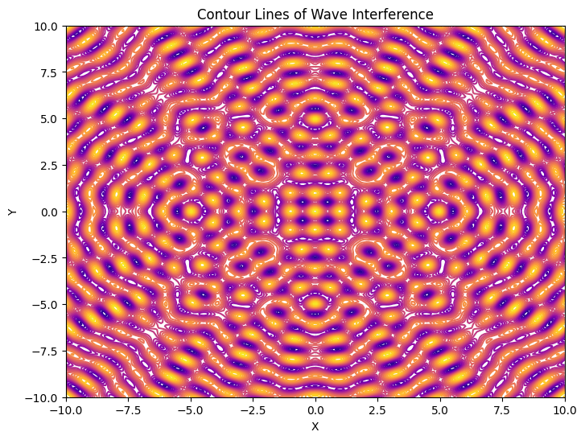

# 🌊 Interference Patterns on a Water Surface

## 🎯 Motivation

Interference occurs when waves from different sources meet and overlap. On a water surface, we can clearly see these effects when ripples from different points intersect. The resulting pattern helps us understand how waves **reinforce** or **cancel** each other out.

Studying these patterns:

* Makes wave physics visual and intuitive
* Helps us learn about **wave phase**, **superposition**, and **wave behavior**
* Can be used in real-world applications like acoustics, optics, and engineering

---

## 📌 Problem Statement

We want to simulate the **interference pattern** formed by **multiple point wave sources** placed at the **corners of a regular polygon** (like a square or triangle).

Each source creates circular waves that spread across a surface. At each point on the surface, we’ll calculate the **combined wave effect** from all the sources using **wave equations** and **superposition**.

---

## 📐 Formula for a Circular Wave

To calculate the wave height (displacement) at any point on the surface, use:

$$
\text{Wave from 1 source:} \quad h_i(x, y) = A \cdot \cos(k \cdot r_i - \omega \cdot t + \phi)
$$

Where:

* $A$ is the wave amplitude
* $r_i = \sqrt{(x - x_i)^2 + (y - y_i)^2}$ is the distance from point $(x, y)$ to the source at $(x_i, y_i)$
* $k = \frac{2\pi}{\lambda}$ is the wave number (related to wavelength $\lambda$)
* $\omega = 2\pi f$ is the angular frequency (related to frequency $f$)
* $\phi$ is the wave’s initial phase
* $t$ is time

---

## 🔗 Superposition: Adding the Waves Together

To find the **total wave height** at any point on the grid, we add the contributions from all sources:

$$
\text{Total wave:} \quad h_{\text{total}}(x, y) = \sum_{i=1}^{N} A \cdot \cos(k \cdot r_i - \omega \cdot t + \phi)
$$

---
### 6. **Visualize**
We'll use Python + Matplotlib to simulate and visualize the interference.

---

## 🧪 Python Simulation

```python
import numpy as np
import matplotlib.pyplot as plt

# 🌊 Wave Parameters
A = 1               # Amplitude of the wave
lambda_ = 1         # Wavelength (distance between peaks)
f = 1               # Frequency (how many waves per second)
omega = 2 * np.pi * f # Angular frequency
k = 2 * np.pi / lambda_  # Wave number
phi = 0             # Initial phase (same for all waves)

# 📐 Polygon Parameters
radius = 5          # Distance from the center to each source (polygon size)
num_sources = 4     # Number of wave sources (e.g., 4 for a square)
grid_size = 200     # Resolution of the grid for the water surface visualization

# 🎯 Create a Grid for the Water Surface
x = np.linspace(-10, 10, grid_size)  # X-axis range
y = np.linspace(-10, 10, grid_size)  # Y-axis range
X, Y = np.meshgrid(x, y)  # Creating a mesh grid for the surface

# 📍 Source Positions (Placed at the Vertices of a Regular Polygon)
theta = np.linspace(0, 2 * np.pi, num_sources, endpoint=False)  # Angle positions of the sources
source_x = radius * np.cos(theta)  # X coordinates of sources
source_y = radius * np.sin(theta)  # Y coordinates of sources

# ⏰ Time Snapshot (Static pattern)
t = 0  # Fixed time to visualize the pattern

# 🌊 Wave Function - Describes the wave at a given point (X, Y)
def wave(x, y, sx, sy):
    r = np.sqrt((x - sx)**2 + (y - sy)**2)  # Distance from source to the point
    return A * np.cos(k * r - omega * t + phi)  # Wave equation: displacement based on distance

# 🌊 Total Wave from All Sources (Superposition Principle)
total = np.zeros_like(X)  # Initialize the grid for total displacement
for i in range(num_sources):
    total += wave(X, Y, source_x[i], source_y[i])  # Adding waves from all sources

# 🌈 Heatmap Visualization of the Interference Pattern
plt.figure(figsize=(8, 6))
plt.imshow(total, extent=[-10, 10, -10, 10], cmap='coolwarm', origin='lower')  # Heatmap of wave displacement
plt.colorbar(label='Wave Displacement')  # Color bar to show the displacement range
plt.scatter(source_x, source_y, color='yellow', edgecolors='black', s=100, label='Sources')  # Mark sources
plt.title("Interference Pattern (Heatmap)", fontsize=14)  # Plot title
plt.xlabel("X Position")  # X-axis label
plt.ylabel("Y Position")  # Y-axis label
plt.grid(True, linestyle='--', alpha=0.3)  # Grid with dashed lines
plt.legend()  # Display the legend
plt.show()

# 🌀 Contour Plot of Wave Interference (Show regions of constructive/destructive interference)
plt.figure(figsize=(8, 6))
plt.contour(X, Y, total, levels=20, cmap='plasma')  # Contour plot with wave levels
plt.scatter(source_x, source_y, color='yellow', edgecolors='black', s=100)  # Mark sources
plt.title("Contour Lines of Wave Interference", fontsize=14)  # Plot title
plt.xlabel("X Position")  # X-axis label
plt.ylabel("Y Position")  # Y-axis label
plt.grid(True, linestyle='--', alpha=0.3)  # Grid with dashed lines
plt.show()


