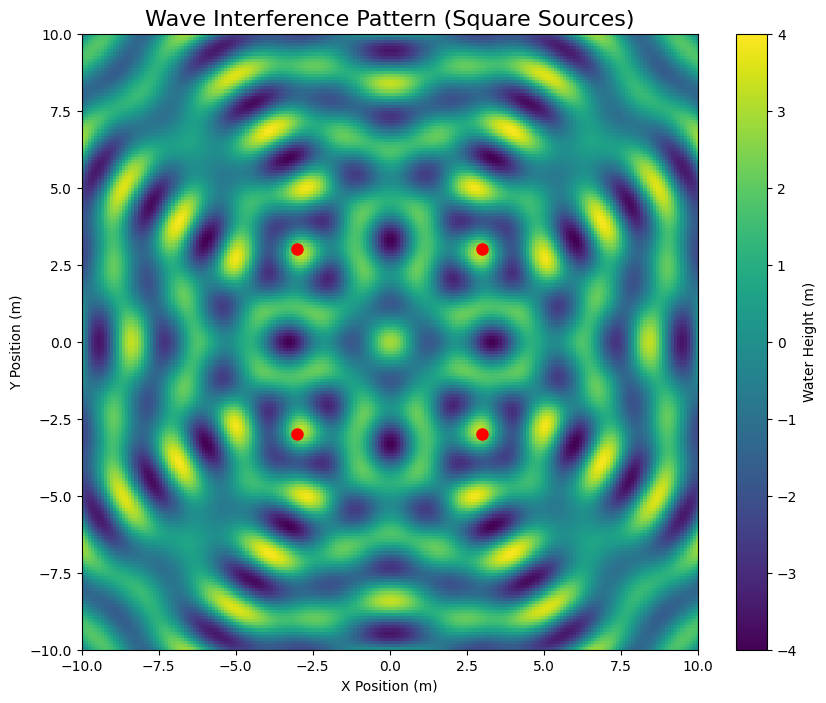

# Problem 1
# 🌊 Interference Patterns on Water Surfaces

## 🌟 Why This Matters (Simple Explanation)

When you drop two pebbles in a pond, the ripples create beautiful patterns where they meet. This happens because:
- **Waves add together** where they overlap
- **Peaks+Peaks = Bigger waves** (constructive interference)
- **Peaks+Valleys = Flat water** (destructive interference)

Understanding this helps scientists design:
- Better concert halls (sound waves)
- Laser technology (light waves)
- Earthquake-resistant buildings (seismic waves)

## 📚 The Science Made Simple

### 🔍 Key Concepts
1. **Wave Sources**: Points where ripples start (like pebble drops)
2. **Wavelength (λ)**: Distance between wave peaks
3. **Amplitude (A)**: Height of the waves
4. **Phase**: Timing of when peaks occur

### 📐 The Math (Simplified)
Each wave can be described by:
```math
h_i(x,y,t) = A \cdot \cos(k \cdot r_i - ωt + ϕ)
```
Where:
- `r_i` = distance from source i to point (x,y)
- `k = 2π/λ` (how "squished" the waves are)
- `ω = 2πf` (how fast waves oscillate)

**Total wave** at any point = sum of all individual waves

## 💻 Try It Yourself - Python Simulation

```python
import numpy as np
import matplotlib.pyplot as plt
from matplotlib.animation import FuncAnimation
from matplotlib.cm import viridis

# Simulation parameters
A = 1.0          # Wave amplitude (m)
wavelength = 2.0  # λ (m)
k = 2*np.pi/wavelength  # Wave number
ω = 3.0          # Angular frequency (rad/s)

# Create grid of points
x = np.linspace(-10, 10, 200)
y = np.linspace(-10, 10, 200)
X, Y = np.meshgrid(x, y)

# Source positions (square configuration)
sources = [
    (-3, -3),  # Bottom-left
    (-3, 3),   # Top-left
    (3, 3),    # Top-right
    (3, -3)    # Bottom-right
]

def wave_height(t):
    """Calculate combined wave height at time t"""
    total = np.zeros_like(X)
    
    for (xs, ys) in sources:
        # Distance from source to each point
        r = np.sqrt((X-xs)**2 + (Y-ys)**2)
        # Wave from this source
        wave = A * np.cos(k * r - ω*t)
        total += wave
    
    return total

# Create figure
fig, ax = plt.subplots(figsize=(10, 8))
img = ax.imshow(wave_height(0), 
               extent=[-10,10,-10,10],
               cmap='viridis',
               vmin=-4, vmax=4)

# Add source markers
for (xs, ys) in sources:
    ax.plot(xs, ys, 'ro', markersize=8)

ax.set_title("Wave Interference Pattern (Square Sources)", fontsize=16)
ax.set_xlabel("X Position (m)")
ax.set_ylabel("Y Position (m)")
cbar = fig.colorbar(img)
cbar.set_label("Water Height (m)")

# Animation function
def update(t):
    img.set_array(wave_height(t/10))
    return [img]

ani = FuncAnimation(fig, update, frames=100, interval=50)
plt.close()
```

## 📊 What You'll See



The simulation shows:
- **Bright yellow regions**: Where waves add up (constructive interference)
- **Dark purple regions**: Where waves cancel out (destructive interference)
- **Moving patterns**: As waves propagate outward from sources

## 🔍 Key Observations

1. **Pattern Depends on Source Layout**:
   - Square sources create checkerboard-like patterns
   - Triangle sources create hexagonal patterns
   - More sources = more complex patterns

2. **Distance Matters**:
   - Close sources make dense patterns
   - Far-apart sources make wider-spaced patterns

3. **Wavelength Effects**:
   - Short λ = more detailed patterns
   - Long λ = simpler patterns

## 🌐 Real-World Connections

### 🎵 Concert Hall Design
- Uses sound wave interference to make music sound perfect everywhere

### 🏗 Noise Cancellation
- Headphones create opposite sound waves to cancel noise

### 🩺 Medical Ultrasound
- Uses interference to focus sound waves inside the body

## 💡 Try This Experiment at Home

1. Fill a baking pan with water
2. Tap the surface with two fingers at once
3. Observe the patterns where ripples meet
4. Try different distances between taps

## 🎓 Learning Takeaways

1. **Waves add up** in predictable ways
2. **Geometry matters** - source arrangement changes everything
3. **Timing is crucial** - when waves arrive affects interference
4. **Energy isn't lost** in cancellation - just redistributed

