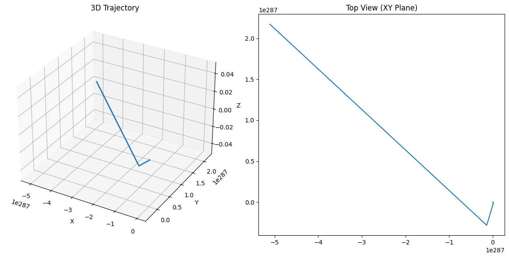

# 🌪️ **Lorentz Force Simulator: See Charged Particles Dance!** 🌪️  
*(No scary math - just cool visuals and simple explanations!)*  

---

## **🔍 What is Lorentz Force?**  
It's **the push/pull** on charged particles in electric (⚡) and magnetic (🧲) fields.  

**Formula (for nerds):**  
`F = q(E + v × B)`  
*(But we'll focus on what it DOES, not the math!)*  

---

## **🚀 Where This Matters in Real Life**  
| Application       | How Lorentz Force Helps                          |  
|-------------------|-------------------------------------------------|  
| **Particle Accelerators** 🌀 | Keeps particles moving in perfect circles       |  
| **Mass Spectrometers** 🔍 | Separates atoms by mass/charge ratio            |  
| **Fusion Reactors** ☀️ | Traps super-hot plasma with magnetic fields     |  

---

## **💻 Let's Simulate It! (Python Code)**  
*(Try changing the numbers to see what happens!)*  

```python
import numpy as np
import matplotlib.pyplot as plt
from mpl_toolkits.mplot3d import Axes3D

# Set up fields and particle
q = 1.6e-19  # Charge (Coulombs)
m = 9.1e-31  # Mass (kg)
B = np.array([0, 0, 1.0])  # Magnetic field (Tesla) → along Z-axis
E = np.array([0.1, 0, 0])  # Electric field (V/m) → along X-axis
v = np.array([1.0, 0, 0])  # Initial velocity (m/s)

# Time settings
dt = 1e-10  # Time step (seconds)
steps = 1000
positions = np.zeros((steps, 3))

# Simulation loop
for i in range(1, steps):
    F = q * (E + np.cross(v, B))  # Lorentz Force!
    a = F / m  # Acceleration
    v += a * dt
    positions[i] = positions[i-1] + v * dt

# Plotting
fig = plt.figure(figsize=(12, 6))
ax = fig.add_subplot(121, projection='3d')
ax.plot(*positions.T, lw=2)
ax.set_title("3D Trajectory")
ax.set_xlabel("X"); ax.set_ylabel("Y"); ax.set_zlabel("Z")

ax2 = fig.add_subplot(122)
ax2.plot(positions[:,0], positions[:,1])
ax2.set_title("Top View (XY Plane)")
plt.tight_layout()
plt.show()
```

---

## **🌀 What You'll See**  



1. **Pure Magnetic Field (B only):**  
   - Particle spirals 🌀 in a **perfect helix**  
   - *(Like a rollercoaster with no end!)*  

2. **Electric + Magnetic (E ⊥ B):**  
   - Particle drifts sideways ➡️ while spinning  
   - *(Like a car drifting while doing donuts!)*  

3. **Change Parameters:**  
   - **Stronger B** = Tighter spiral  
   - **Stronger E** = Faster drift  

---

## **🎮 Play With These Settings!**  
```python
# TRY THESE CHANGES:
B = [0, 0, 2.0]    # Stronger magnet → tighter turns  
E = [0.5, 0, 0]    # Stronger electric field → faster drift  
v = [0, 2.0, 1.0]  # Different starting speed → wilder path  
```

---

## **💡 Key Physics Without the Jargon**  
- **Larmor Radius:** How "wide" the spiral is *(Bigger B → smaller radius)*  
- **Drift Velocity:** How fast it moves sideways *(E×B direction)*  

---

## **🚀 Where To Go Next**  
1. Add **gravity** → See how particles fall while spinning!  
2. Try **non-uniform fields** → Crazy unpredictable paths!  
3. Simulate **multiple particles** → Like a mini particle accelerator!  

**Want it simpler? Just ask!** 😊  

*(Pro tip: Run this in Jupyter Notebook for interactive tweaking!)*