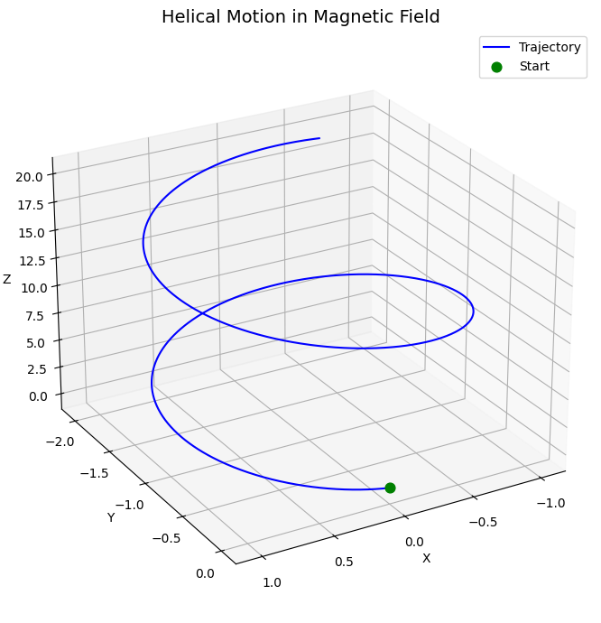

### **Simulating the Effects of the Lorentz Force**

#### **Motivation**:

The Lorentz force, expressed as:

$$
\mathbf{F} = q (\mathbf{E} + \mathbf{v} \times \mathbf{B})
$$

governs the motion of charged particles in electric and magnetic fields. It is foundational in fields like plasma physics, particle accelerators, and astrophysics. By focusing on simulations, we can explore the practical applications and visualize the complex trajectories that arise due to this force.

---

### **Task**:

1. **Exploration of Applications**:

   * Identify systems where the Lorentz force plays a key role (e.g., particle accelerators, mass spectrometers, plasma confinement).
   * Discuss the relevance of electric ($\mathbf{E}$) and magnetic ($\mathbf{B}$) fields in controlling the motion of charged particles.

2. **Simulating Particle Motion**:

   * Implement a simulation to compute and visualize the trajectory of a charged particle under:

     * A uniform magnetic field.
     * Combined uniform electric and magnetic fields.
     * Crossed electric and magnetic fields.
   * Simulate the particle’s circular, helical, or drift motion based on initial conditions and field configurations.

3. **Parameter Exploration**:

   * Allow variations in:

     * Field strengths ($E$, $B$).
     * Initial particle velocity ($v_0$).
     * Charge and mass of the particle ($q$, $m$).
   * Observe how these parameters influence the trajectory.

4. **Visualization**:

   * Create clear, labeled plots showing the particle’s path in 2D and 3D for different scenarios.
   * Highlight physical phenomena such as the Larmor radius and drift velocity.

---

### **Formulas**:

The Lorentz force equation is given by:

$$
\mathbf{F} = q (\mathbf{E} + \mathbf{v} \times \mathbf{B})
$$

Where:

* $\mathbf{F}$ is the force acting on the charged particle.
* $q$ is the charge of the particle.
* $\mathbf{E}$ is the electric field.
* $\mathbf{v}$ is the velocity of the particle.
* $\mathbf{B}$ is the magnetic field.
* $\times$ represents the cross product between velocity and the magnetic field.

For a particle moving in a uniform magnetic field, its trajectory can be described by circular motion, and the radius of this motion (Larmor radius) is given by:

$$
r = \frac{mv_{\perp}}{qB}
$$

Where:

* $m$ is the mass of the particle.
* $v_{\perp}$ is the component of the velocity perpendicular to the magnetic field.
* $q$ is the charge of the particle.
* $B$ is the magnetic field strength.

---

### **Visualization of Particle Motion**:

Below is a Python simulation to visualize the particle's trajectory under the influence of a magnetic field.

---

### **Python Code**:

```python
import numpy as np
import matplotlib.pyplot as plt
from mpl_toolkits.mplot3d import Axes3D

# -----------------------
# ⚙️ Parameters
# -----------------------
q = 1.0         # Charge
m = 1.0         # Mass
B = np.array([0, 0, 1.0])  # Magnetic field along z-axis
E = np.array([0.0, 0.0, 0.0])  # No electric field

r = np.array([0.0, 0.0, 0.0])  # Initial position
v = np.array([1.0, 0.0, 2.0])  # Initial velocity (x: circular, z: helical)

dt = 0.01
T = 10
steps = int(T / dt)

# -----------------------
# 🔁 Lorentz Force
# -----------------------
def lorentz_force(v, r, q, m, E, B):
    return (q / m) * (E + np.cross(v, B))

# -----------------------
# 🧮 Simulate
# -----------------------
trajectory = []
for _ in range(steps):
    trajectory.append(r.copy())
    a = lorentz_force(v, r, q, m, E, B)
    v += a * dt
    r += v * dt
trajectory = np.array(trajectory)

# -----------------------
# 📊 3D Plot
# -----------------------
fig = plt.figure(figsize=(10, 7))
ax = fig.add_subplot(111, projection='3d')
ax.plot(trajectory[:, 0], trajectory[:, 1], trajectory[:, 2], color='blue', label='Trajectory')
ax.scatter(trajectory[0, 0], trajectory[0, 1], trajectory[0, 2], color='green', s=60, label='Start')
ax.set_title("Helical Motion in Magnetic Field", fontsize=14)
ax.set_xlabel("X")
ax.set_ylabel("Y")
ax.set_zlabel("Z")
ax.grid(True)
ax.legend()
ax.view_init(elev=25, azim=60)
plt.tight_layout()
plt.show()
```

---

This code simulates the motion of a charged particle in a uniform magnetic field and visualizes its trajectory. The plot will show how the particle moves in a circular path due to the Lorentz force.
