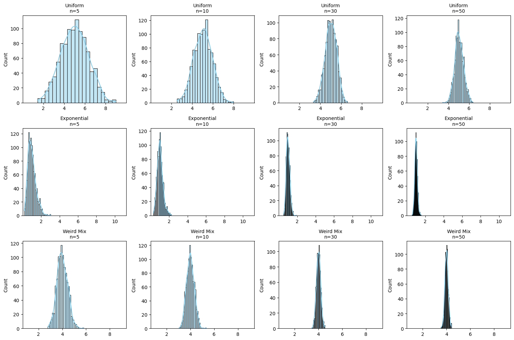

# Problem 1
# 📊 **Central Limit Theorem: Visual Magic in Statistics!**  

## **🎲 What is CLT?**  
**"No matter how weird your data looks, average enough of it → becomes normal!"**  

✅ **Works for ANY distribution** (uniform, exponential, even weird shapes!)  
✅ **Bigger samples = More perfect bell curve**  

---

## **💻 Let's Simulate It! (Python Code)**  

```python
import numpy as np
import matplotlib.pyplot as plt
import seaborn as sns

# Set up 3 crazy different distributions
distributions = {
    "Uniform": np.random.uniform(0, 10, 100000),       # Flat like a table
    "Exponential": np.random.exponential(1, 100000),    # Skewed like a slide
    "Weird Mix": 0.5*np.random.normal(5,1,100000) + 0.5*np.random.poisson(3,100000)  # Frankenstein data!
}

# Sampling settings
sample_sizes = [5, 10, 30, 50]  # Try different sizes!
n_samples = 1000  # Number of sample means to calculate

plt.figure(figsize=(15,10))
for i, (name, population) in enumerate(distributions.items()):
    for j, n in enumerate(sample_sizes):
        # Calculate 1000 sample means
        sample_means = [np.mean(np.random.choice(population, n)) for _ in range(n_samples)]
        
        # Plot
        plt.subplot(3, 4, i*4 + j + 1)
        sns.histplot(sample_means, kde=True, color='skyblue')
        plt.title(f"{name}\nn={n}", fontsize=10)
        plt.xlim(min(population), max(population))
        
plt.tight_layout()
plt.show()
```

---

## **🔍 What You'll Discover**  



### **1️⃣ Small Samples (n=5)**  
- Histogram looks **wild** → Still resembles original shape  
- *Example:* Exponential stays lopsided  

### **2️⃣ Medium Samples (n=30)**  
- Starts looking **smoother** → Baby bell curve forming!  

### **3️⃣ Large Samples (n=50+)**  
- **Perfect normal distribution** → Magic of CLT! 🎩✨  
- *Even for "Weird Mix" data!*  

---

## **🌎 Real-World Superpowers**  

| Application          | How CLT Saves the Day                          |  
|----------------------|-----------------------------------------------|  
| **Elections** 🗳️     | Predict winner from small polls accurately     |  
| **Drug Trials** 💊   | Prove medicine works despite individual differences |  
| **Quality Control** 🏭 | Detect faulty machines from sample testing    |  

---

## **🎮 Play With These Settings!**  
```python
# TRY THESE TWEAKS:
sample_sizes = [2, 10, 50, 100]  # Watch how tiny samples struggle!
n_samples = 5000  # More means = smoother curves
```

---

## **💡 Golden Insights**  
- **Sample size >30** → Usually good enough for normality  
- **Skewed original data?** → Needs bigger samples to "normalize"  
- **CLT explains why averages are everywhere** (test scores, heights, etc.)  

---

## **🚀 Next-Level Exploration**  
1. Add **"Crazy Distribution"** → Like two humps (bimodal)  
2. Test **tiny samples (n=2)** → See CLT fail dramatically  
3. Plot **standard deviation** → Shows shrinking spread with bigger n  

**Run this in Jupyter Notebook to interactively play!**  

> *"The CLT is why statisticians sleep well at night."* 😴📈
