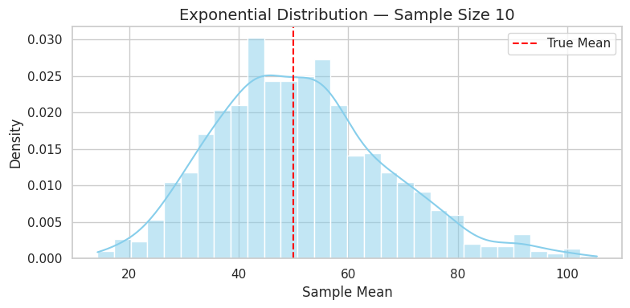

# 🧪 Central Limit Theorem: Simulation & Insights

## 🧠 What’s the CLT?

The **Central Limit Theorem (CLT)** says:

> If you take many samples of size **n** from any population, the distribution of their **means** will tend to look **normal**, as **n gets large** — even if the original population is not normal.


```python
import numpy as np
import matplotlib.pyplot as plt
import seaborn as sns

# Settings
sns.set(style="whitegrid")
np.random.seed(42)

pop_size = 100_000
sample_sizes = [10]
n_samples = 1000

# Simulation function
def simulate_clt(population, title):
    for size in sample_sizes:
        sample_means = [np.mean(np.random.choice(population, size=size)) for _ in range(n_samples)]

        plt.figure(figsize=(8, 4))
        sns.histplot(sample_means, kde=True, bins=30, stat="density", color="skyblue")
        plt.axvline(np.mean(population), color="red", linestyle="--", label="True Mean")
        plt.title(f"{title} — Sample Size {size}", fontsize=14)
        plt.xlabel("Sample Mean")
        plt.ylabel("Density")
        plt.legend()
        plt.tight_layout()
        plt.show()

# Run simulations
uniform_pop = np.random.uniform(0, 100, size=pop_size)
simulate_clt(uniform_pop, "Uniform Distribution")

exp_pop = np.random.exponential(scale=50, size=pop_size)
simulate_clt(exp_pop, "Exponential Distribution")

binom_pop = np.random.binomial(n=10, p=0.5, size=pop_size)
simulate_clt(binom_pop, "Binomial Distribution")
```

---

## 🔍 What Did We Learn?

* Even from **non-normal distributions** like Exponential or Binomial, the **sample means** become more **bell-shaped** as sample size grows.
* The **spread** of the sample mean shrinks with larger sample sizes — this is due to reduced standard error.
* CLT is **powerful**: it enables normal-based inference in the real world, even if your raw data isn’t normal.

---

## 💼 Applications

* **Polling** and **surveys** — estimate average opinion from small samples.
* **Manufacturing** — control product quality using means from random checks.
* **Finance** — model returns, errors, and risk from sample averages.

---


