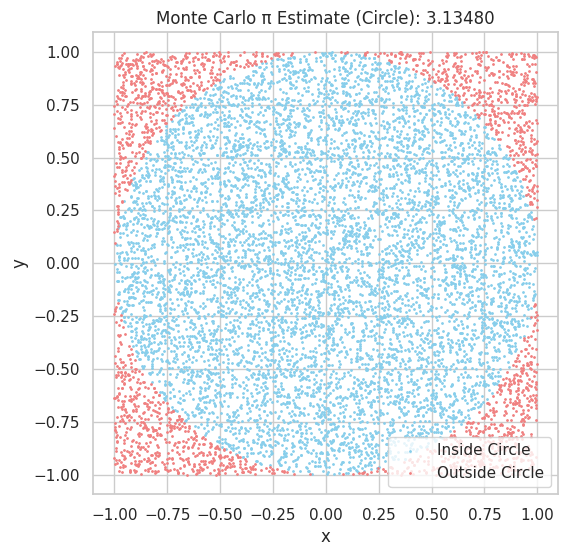
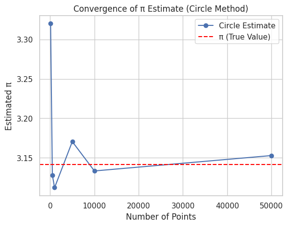
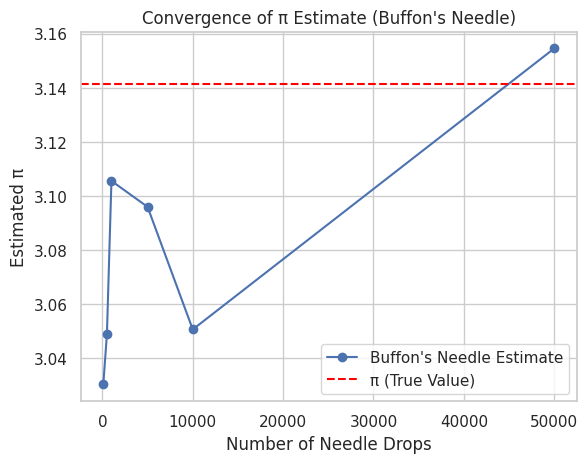

 **Estimating π using Monte Carlo Methods** with:

* 🔵 **Part 1**: Circle-Based Simulation
* 🪡 **Part 2**: Buffon’s Needle
* 📊 Visuals, ✅ Explanations, 📈 Analysis

---

# 🎯 Estimating π with Monte Carlo Methods

---

## 🍰 Part 1: Estimating π Using a Circle

### 🧠 Idea:

* Draw a square (side = 2) around a unit circle (radius = 1).
* Random points fall randomly inside the square.
* Count how many fall **inside the circle**.
* Since area of circle = πr² = π and area of square = 4,
  $\pi \approx 4 \cdot \left(\frac{\text{points in circle}}{\text{total points}}\right)$

---

### ⚙️ Code

```python
import numpy as np
import matplotlib.pyplot as plt

# Parameters
np.random.seed(42)
total_points = 10000

# Generate random (x, y) in square [-1, 1] x [-1, 1]
x = np.random.uniform(-1, 1, total_points)
y = np.random.uniform(-1, 1, total_points)

# Distance from origin
dist = x**2 + y**2

# Points inside circle
inside = dist <= 1
pi_estimate = 4 * np.sum(inside) / total_points

# Plot
plt.figure(figsize=(6, 6))
plt.scatter(x[inside], y[inside], color="skyblue", s=1, label="Inside Circle")
plt.scatter(x[~inside], y[~inside], color="lightcoral", s=1, label="Outside Circle")
plt.title(f"Monte Carlo π Estimate: {pi_estimate:.5f}")
plt.xlabel("x")
plt.ylabel("y")
plt.legend()
plt.axis("equal")
plt.grid(True)
plt.show()
```

---

## 📈 Convergence Check (Circle Method)

```python
trials = [100, 500, 1000, 5000, 10000, 50000]
estimates = []

for N in trials:
    x = np.random.uniform(-1, 1, N)
    y = np.random.uniform(-1, 1, N)
    inside = x**2 + y**2 <= 1
    estimates.append(4 * np.sum(inside) / N)

# Plot convergence
plt.plot(trials, estimates, marker='o')
plt.axhline(np.pi, color='red', linestyle='--', label='π (True Value)')
plt.title("Convergence of π Estimate (Circle Method)")
plt.xlabel("Number of Points")
plt.ylabel("Estimated π")
plt.legend()
plt.grid(True)
plt.show()
```

---

## 🪡 Part 2: Estimating π Using Buffon’s Needle

### 🧠 Idea:

* Drop a needle of length **L ≤ d** between parallel lines **d** units apart.
* Probability of crossing a line is:
  $P = \frac{2L}{\pi d}$
* Rearranged:
  $\pi \approx \frac{2L \cdot N}{d \cdot H}$
  where:

  * **N** = total drops
  * **H** = hits (crossing a line)

---

### ⚙️ Code

```python
import numpy as np
import matplotlib.pyplot as plt

np.random.seed(42)

# --- Part 1: Circle Monte Carlo ---

def estimate_pi_circle(total_points):
    x = np.random.uniform(-1, 1, total_points)
    y = np.random.uniform(-1, 1, total_points)
    inside = x**2 + y**2 <= 1
    pi_estimate = 4 * np.sum(inside) / total_points
    return pi_estimate, x, y, inside

# Plot circle method points and estimate
total_points = 10000
pi_estimate, x, y, inside = estimate_pi_circle(total_points)

plt.figure(figsize=(6,6))
plt.scatter(x[inside], y[inside], color="skyblue", s=1, label="Inside Circle")
plt.scatter(x[~inside], y[~inside], color="lightcoral", s=1, label="Outside Circle")
plt.title(f"Monte Carlo π Estimate (Circle): {pi_estimate:.5f}")
plt.xlabel("x")
plt.ylabel("y")
plt.legend()
plt.axis("equal")
plt.grid(True)
plt.show()

# Convergence plot for circle method
trials = [100, 500, 1000, 5000, 10000, 50000]
estimates_circle = []
for N in trials:
    pi_val, _, _, _ = estimate_pi_circle(N)
    estimates_circle.append(pi_val)

plt.plot(trials, estimates_circle, marker='o', label='Circle Estimate')
plt.axhline(np.pi, color='red', linestyle='--', label='π (True Value)')
plt.title("Convergence of π Estimate (Circle Method)")
plt.xlabel("Number of Points")
plt.ylabel("Estimated π")
plt.legend()
plt.grid(True)
plt.show()

# --- Part 2: Buffon's Needle ---

def estimate_pi_buffon(L, d, N):
    theta = np.random.uniform(0, np.pi/2, N)
    x_center = np.random.uniform(0, d/2, N)
    hits = x_center <= (L/2)*np.sin(theta)
    H = np.sum(hits)
    if H == 0:
        return np.nan
    return (2 * L * N) / (d * H)

L = 1  # needle length
d = 2  # distance between lines
N = 10000

pi_buffon = estimate_pi_buffon(L, d, N)
print(f"Buffon's Needle π Estimate: {pi_buffon:.5f}")

# Convergence plot for Buffon's Needle
estimates_buffon = []
for N in trials:
    pi_val = estimate_pi_buffon(L, d, N)
    estimates_buffon.append(pi_val)

plt.plot(trials, estimates_buffon, marker='o', label="Buffon's Needle Estimate")
plt.axhline(np.pi, color='red', linestyle='--', label='π (True Value)')
plt.title("Convergence of π Estimate (Buffon's Needle)")
plt.xlabel("Number of Needle Drops")
plt.ylabel("Estimated π")
plt.legend()
plt.grid(True)
plt.show()
```



---

## 💬 Observations

* The **circle method** converges more quickly and visually.
* **Buffon’s needle** is less efficient — more randomness, slower convergence.
* Both methods show how **randomness + geometry = powerful math**.

---
