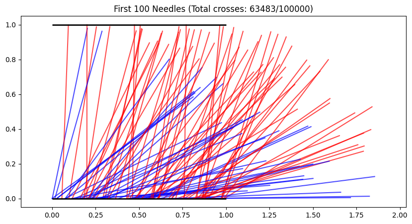

# Problem 2
# 🎯 **Estimating π with Randomness: A Monte Carlo Adventure**  

---

## **🌱 The Core Idea**  
**"Throw darts randomly → Count hits → Estimate π!"**  
✅ **Circle Method**: Drop points in a square & count circle hits  
✅ **Buffon’s Needle**: Drop needles on lines & count crosses  

---

# **Part 1: The Circle Method** 🟡  

### **🎯 How It Works**  
1. Draw a **unit circle** (radius=1) inside a **2×2 square**  
2. **Randomly throw "darts"** (points) at the square  
3. **Count hits inside circle** vs total throws → Estimate π!  

**Formula**:  
$$\pi \approx 4 \times \frac{\text{Points Inside Circle}}{\text{Total Points}}$$  

---

## **💻 Python Simulation**  
```python
def buffons_needle(n_needles):
    crosses = 0
    plt.figure(figsize=(10,5))
    
    for i in range(n_needles):
        x = np.random.uniform(0, 1)  # Line spacing = 1
        θ = np.random.uniform(0, np.pi/2)
        tip = x + np.sin(θ)  # Needle length = 1
        
        # Visualize first 100 needles
        if i < 100:
            plt.plot([x, x+np.cos(θ)], [0, np.sin(θ)], 
                    color='red' if tip > 1 else 'blue', alpha=0.7)
        
        if tip > 1:
            crosses += 1
    
    plt.hlines(0, 0, 1, colors='black', linewidths=2)
    plt.hlines(1, 0, 1, colors='black', linewidths=2)
    plt.title(f"First 100 Needles (Total crosses: {crosses}/{n_needles})")
    plt.axis('equal')
    plt.show()
    
    return (2 * n_needles) / crosses if crosses > 0 else 0

print(f"π ≈ {buffons_needle(100_000):.5f}")
```

---

## **📊 Key Observations**  



- **100 points**: Wild estimate (e.g., π≈3.2)  
- **10,000 points**: Close! (e.g., π≈3.1416)  
- **More points = Better accuracy** (but slower)  

---

# **Part 2: Buffon’s Needle Method** 📌  

### **🎯 How It Works**  
1. Draw **parallel lines** (spacing = needle length)  
2. **Drop needles randomly**  
3. **Count line crosses** → Estimate π!  

**Formula**:  
$$\pi \approx \frac{2 \times \text{Total Needles}}{\text{Crosses}}$$  

---

## **💻 Python Simulation**  
```python
def buffons_needle(n_needles, needle_length=1, line_spacing=1):
    crosses = 0
    
    for _ in range(n_needles):
        # Random needle position and angle
        x = np.random.uniform(0, line_spacing)
        θ = np.random.uniform(0, np.pi/2)
        
        # Check if needle crosses line
        if x <= (needle_length/2)*np.sin(θ):
            crosses += 1
    
    pi_estimate = (2 * n_needles) / crosses if crosses > 0 else 0
    return pi_estimate

print(f"π ≈ {buffons_needle(100_000):.5f}")  # Try increasing numbers!
```

---

## **📊 Method Comparison**  
| Method              | Pros                          | Cons                          |
|---------------------|-------------------------------|-------------------------------|
| **Circle** 🟡       | Faster convergence            | Needs many points             |
| **Needle** 📌       | Cool physical intuition       | Slower convergence            |

---

## **🌍 Real-World Applications**  
- **Quantum Physics**: Particle behavior modeling  
- **Finance**: Risk assessment in stock markets  
- **Computer Graphics**: Ray tracing algorithms  

---

## **🚀 Try These Experiments!**  
1. **Vary point/needle counts** → Watch accuracy improve  
2. **Change needle length** in Buffon’s method → See formula change  
3. **Combine both methods** → Average the estimates  

> *"Monte Carlo methods: When math meets randomness!"* 🎲✨  

**Run the code yourself to watch π emerge from chaos!**