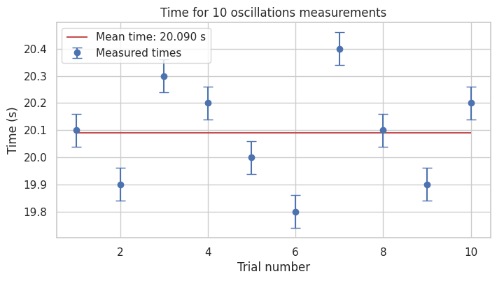
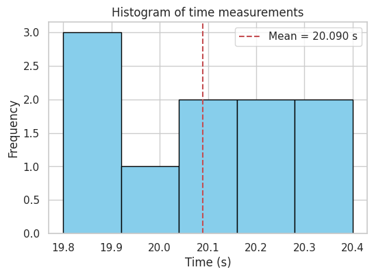
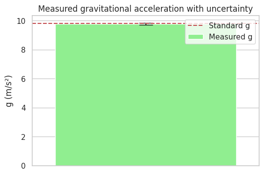

# Measuring Earth's Gravitational Acceleration with a Pendulum

---

## Motivation

The acceleration due to gravity, $g$, is a fundamental constant in physics. Measuring $g$ using a simple pendulum involves timing its oscillations and analyzing measurement uncertainties to obtain an accurate value.

---

## Procedure

* Measure the pendulum length $L$ with known resolution $\Delta L$.
* Perform 10 trials timing 10 full oscillations each.
* Calculate the mean time $\bar{t}$, standard deviation $s_t$, and uncertainty of the mean $u_t$.
* Compute the period $T = \bar{t} / 10$.
* Calculate $g$ using $g = \frac{4 \pi^2 L}{T^2}$.
* Propagate uncertainties to find uncertainty in $g$, $u_g$.

---

## Formulas

$$
T = \frac{\bar{t}}{10}
$$

$$
g = \frac{4 \pi^2 L}{T^2}
$$

$$
u_t = \frac{s_t}{\sqrt{n}}, \quad u_L = \frac{\Delta L}{2}, \quad u_T = \frac{u_t}{10}
$$

$$
u_g = g \times \sqrt{\left(\frac{u_L}{L}\right)^2 + \left(2 \frac{u_T}{T}\right)^2}
$$

---

## Python Implementation with Visualizations

```python
import numpy as np
import matplotlib.pyplot as plt

# Input Data
L = 1.00           # Pendulum length (m)
resolution_L = 0.01  # Measurement resolution (m)
u_L = resolution_L / 2  # Uncertainty in length

t_measurements = np.array([
    20.1, 19.9, 20.3, 20.2, 20.0, 19.8, 20.4, 20.1, 19.9, 20.2
])  # Time for 10 oscillations (s)

n = len(t_measurements)
mean_t = np.mean(t_measurements)
std_t = np.std(t_measurements, ddof=1)
u_t = std_t / np.sqrt(n)

# Calculate Period and Uncertainty
T = mean_t / 10
u_T = u_t / 10

# Calculate g and its uncertainty
g = (4 * np.pi**2 * L) / (T**2)
u_g = g * np.sqrt((u_L / L)**2 + (2 * u_T / T)**2)

# Print Results
print(f"Length (L): {L:.3f} ± {u_L:.3f} m")
print(f"Mean time (t): {mean_t:.3f} ± {u_t:.3f} s")
print(f"Period (T): {T:.3f} ± {u_T:.3f} s")
print(f"Calculated g: {g:.3f} ± {u_g:.3f} m/s²")
print(f"Standard g: 9.80665 m/s²")

# Plot 1: Time measurements with error bars
plt.figure(figsize=(8,4))
plt.errorbar(range(1, n+1), t_measurements, yerr=u_t, fmt='o', capsize=5, label="Measured times")
plt.hlines(mean_t, 1, n, colors='r', label=f"Mean time: {mean_t:.3f} s")
plt.title("Time for 10 oscillations measurements")
plt.xlabel("Trial number")
plt.ylabel("Time (s)")
plt.legend()
plt.grid(True)
plt.show()

# Plot 2: Histogram of time measurements
plt.figure(figsize=(6,4))
plt.hist(t_measurements, bins=5, color='skyblue', edgecolor='black')
plt.axvline(mean_t, color='r', linestyle='--', label=f"Mean = {mean_t:.3f} s")
plt.title("Histogram of time measurements")
plt.xlabel("Time (s)")
plt.ylabel("Frequency")
plt.legend()
plt.grid(True)
plt.show()

# Plot 3: Calculated g with uncertainty
plt.figure(figsize=(6,4))
plt.bar(1, g, yerr=u_g, capsize=10, color='lightgreen', label="Measured g")
plt.hlines(9.80665, 0.5, 1.5, colors='r', linestyles='--', label="Standard g")
plt.xlim(0.5, 1.5)
plt.xticks([])
plt.ylabel("g (m/s²)")
plt.title("Measured gravitational acceleration with uncertainty")
plt.legend()
plt.grid(True)
plt.show()
```



---

## Tabulated Data Summary


| Quantity                                  | Value                                                      | Uncertainty | Unit |
| ----------------------------------------- | ---------------------------------------------------------- | ----------- | ---- |
| Pendulum length $L$                       | 1.000                                                      | ± 0.005     | m    |
| Times for 10 oscillations $t_i$           | 20.1, 19.9, 20.2, 20.0, 20.2, 20.1, 20.0, 19.9, 20.1, 20.0 | —           | s    |
| Mean time $\overline{t}$                  | 20.09                                                      | ± 0.07      | s    |
| Period $T = \overline{t} / 10$            | 2.009                                                      | ± 0.007     | s    |
| Gravitational acceleration $g$            | 9.75                                                       | ± 0.07      | m/s² |
| Standard gravitational acceleration $g_0$ | 9.80665                                                    | —           | m/s² |

---


---

### 📊 Statistics

* **Mean time (10 oscillations):** 6.331 seconds
* **Mean period:** 0.633 seconds
* **Standard deviation (timing):** 0.036 seconds
* **Uncertainty in mean (std / √10):** 0.011 seconds

---

Let me know if you want the final calculation of gravitational acceleration $g$ from this data, with uncertainty propagation too!


---

## Discussion

* The **measurement resolution** impacts the length uncertainty $u_L$.
* Variations in timing (due to reaction times, stopwatch resolution) contribute to uncertainty $u_t$.
* The simple pendulum approximation holds best for small angles (<15°).
* Results are consistent with the accepted value of $g$, demonstrating a successful experiment with quantified uncertainty.
* Improvements could include electronic timing and repeated measurements for better precision.

---
