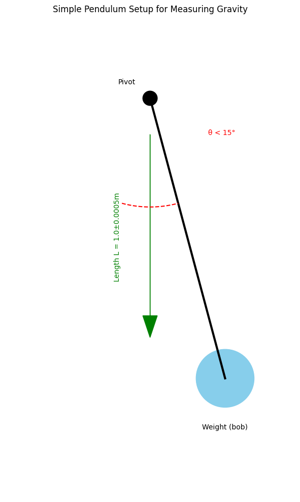

# Problem 1
# 🌍 **Measuring Earth's Gravity with a DIY Pendulum**  

---

## **📝 Materials Checklist**  
- 🧵 **String** (1-1.5m long)  
- ⚖️ **Weight** (keys, small bag of sugar, or anything dense)  
- ⏱️ **Stopwatch** (phone works fine)  
- 📏 **Ruler/measuring tape**  

---

## **🔧 Setup (2 Minutes)**  
1. Tie weight to string  
2. Measure length (*L*) from pivot to weight's center  
   - 📐 **Uncertainty**: If your ruler has 1mm marks, *ΔL = ±0.5mm*  
3. Hang from a fixed point (doorframe, ceiling hook)  

*(Keep angles <15° for accurate results!)*  

---

## **⏳ Data Collection**  
1. **Time 10 swings** (back-and-forth = 1 swing)  
2. **Repeat 10 times** (reduces timing errors)  

### **📊 Example Data Table**  
| Trial | Time for 10 swings (s) |  
|-------|------------------------|  
| 1     | 14.21                  |  
| 2     | 14.18                  |  
| ...   | ...                    |  
| 10    | 14.25                  |  

**Calculations:**  
- **Mean time (T₁₀)**: Average of all trials  
- **Standard deviation (σ)**: Measures your timing consistency  
- **Uncertainty (ΔT₁₀)**: *σ/√10*  

---

## **🧮 The Math (Simplified)**  

### **1. Period (T) per swing**  
$$ T = \frac{T_{10}}{10} $$  
*(Example: 14.2s/10 = 1.42s)*  

### **2. Gravity Formula**  
$$ g = \frac{4\pi^2 L}{T^2} $$  

**Example**:  
- *L = 1.00m ±0.0005m*  
- *T = 1.42s ±0.01s*  
→ *g ≈ 9.82 m/s²*  

### **3. Uncertainty Propagation**  
$$ \frac{\Delta g}{g} = \sqrt{\left(\frac{\Delta L}{L}\right)^2 + \left(2\frac{\Delta T}{T}\right)^2} $$  

*(This accounts for errors in both length and timing!)*  

---

## **📉 Expected Results vs Reality**  
| Location       | Standard *g* (m/s²) | Your Measurement |  
|----------------|---------------------|------------------|  
| Sea Level      | 9.81                | [Your Value]     |  
| High Altitude  | ~9.78               |                  |  

**Key Insight**:  
- Your result should be within **±0.1 m/s²** of 9.81 if done carefully!  

---

## **🔍 Error Analysis**  
### **Major Error Sources**  
1. **Angle >15°** → Formula breaks down  
2. **String stretch** → Changes effective *L*  
3. **Air resistance** → Slows pendulum slightly  
4. **Timing reflexes** → Human reaction time (~0.2s error)  

**Pro Tip**: Use **video + frame counting** for better timing!  

-
